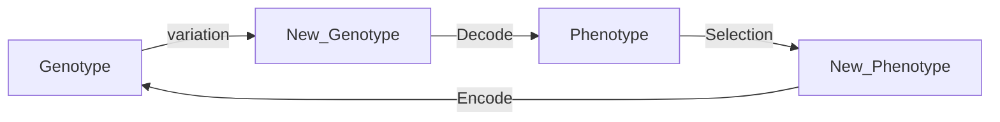

> “The study of computational systems that use ideas inspired from natural evolution, e.g., the principle of survival of the fittest.”

# Evolutionary Computation

EC provides a general method for solving ‘search for solutions’ type of problems, such as optimisation, learning, and design.

## Progress:

Week 2…


## What will be covered?

**Algorithms** 

- [Randomized Search Heuristics ](#Randomised Algorithm)
- [Local Search Algorithms](#Local Search Algorithms)
- [**Evolutionary Algorithms:**](Evolutionary Algorithms) [Genetic Algorithms](#Genetic Algorithm (GA)), Genetic Programming, Evolutionary Programming, Differential Evolution and Evolution Strategies 
- Game Theory (optimisation) and Evolutionary Game Theory (dynamics) 
- Particle Swarm Optimiser & Ant Colony Optimisation 
- Artificial Immune System

**Theory** 

- Schema Theorem -
- Convergence and Convergence Rate -
- Computational Complexity -
- No Free Lunch Theorem 
- Fitness Landscape 
- Boolean Networks 
- Cellular Automata (including Game of Life)


### Categories of Algorithms by by design paradigm

- Divide and conquer algorithms, e.g., quicksort algorithm 

- Dynamic programming algorithms 

- Mathematical programming algorithms, e.g., linear programming 

- Search and enumeration algorithms 
  - Brute force (exhaustive) algorithms, enumerating all possible candidate solutions and check 
  
  - Improved brute force algorithms, e.g., branch and bound algorithms 
  
  - **Heuristic algorithms** 
    - Local search, e.g., greedy search 
    
    - **Randomised algorithms**, which include Evolutionary Computation, etc
    
      

### 

### Travelling salesman problem (TSP)

Given a list of cities $x_i\in\mathbb R^n$ and the distances matrix between each pair of them.

Seek for the shortest rout that visits each city exactly once and returns to the origin city.


Solve TSP using:

- Brute force $O(n!)$, or improved **branch and cut** $O(1.9999^n)$

- Mathematical programming algo, e.g. **linear programming** (itself is a NP-hard problem, see [here]([Microsoft Word - Why_LP_cannot_solve_large_instances_of_NP-complete_problems_in_polynomial_time.doc (arxiv.org)](https://arxiv.org/ftp/cs/papers/0611/0611008.pdf))).

- So **Heuristic algotithms**

  

## Randomised Algorithm

Start with Question: **Matching one Bolt to n Distinct Sizes Nuts:**

given one bolt and a collection of n nuts of different sizes, find a nut match the bolt

The brute-force solution time complexity: O(n2)

**Answer:** For many problems, a randomised algorithm is the simplest, the fastest.


**Heuristic Algo**

CS definition of **heuristic**:  a (usually simple) algorithm that produces a good enough solution for a problem in a reasonable time frame

heuristic: find or discover non-optimal but satisfactory

Trad of optimality, completness, accuracy or precision for **speed**.

Includes determiistic (e.g. 0 or 1 results)


makes random choices during execution,

output and runtime can vary even with fixed input.


Use random number to help find and improve the solutions.

##### Two representatives:

- Las Vegas Algo

  may result in infinite loop until the correct solution

  ```
  Repeat:
  	Random search 1 element out of n samples.
  	until a == x
  end
  ```

  the worst runtime complexity is unbound

- Monte Carlo Algo (蒙特卡罗)

  runs for a fixed number of steps

  ```
  i = 0
  Repeat:
  	Random search 1 element out of n samples.
  	i += 1;
  	until (a == x) || (i == k)
  end
  ```

​		O(1) is fixed


##### Randomised Quicksort Algo

avg: O(nlogn), worst: O(2nlogn)


## Local Search Algorithms

A heuristic algorithm for solving hard optimization problems.

**Idea**: start with an initial guess at a solution and incrementally improve it until it is one 

**Incremental improvement**: local changes, e.g., the algorithm iteratively moves to a neighbour solution 

**Neighbour solution**: Depends on the definition of a neighbourhood relation on the search space, but generally based on similarity (distance) measure

### Hill Climbing Algo

> Climbing Everest in thick fog with amnesia

Search for its better **Immediate neighbour solutions**, which is the most similar solutions to the current solution.

Two types of hill climbing: 

- **Simple hill climbing:** chooses the **first** better solution 
- **Steepest ascent hill climbing:** compares all neighbour solutions and chooses the best solution

**2-Opt Algorithm**

Detailed swapping steps for swapping two edges, which result in an **immediate neighbour solutions**: 

- Step 1: removal of two edges from the current route, which results in two parts of the route. 
- Step 2: reconnect by two other edges to obtain a new solution


What is **3-Opt Algo**?


#TODO How to draw fitness landscape in high dimension?

**Randomised search vs Local search**

- Random
  - Good at exploration, Not good at exploitation
  - Especially bad for problems solution only lies on narrow space.
- Local
  - Not good at exploration: gets stuck in local minima.
  - Good at exploitation: capable of finding local optimum

### Stochastic Local Search algorithms

Main idea: escape or avoid local optima, introduce randomness into local search algo.

**Escape stategies:**

- **Random restart**: simply restart the local search from a random initial solution
- Perform non-improving step: randomly move to a less fit neighbour – **Simulated Annealing (SA)** 


Accepting worse solutions with a certain probability, e.g., $P:=\exp \left(\frac{e-e_{\text {new }}}{T}\right)$ if $e_{\text {new }} \geq e$, which is worse.

Other: [Tabu Search]([Tabu Search: A Tutorial. (liu.se)](https://www.ida.liu.se/~zebpe83/heuristic/papers/TS_tutorial.pdf))

## Evolutionary Algorithms


An Evolutionary Algorithms consists of: representation: each solution is called an individual fitness (objective) function: to evaluate solutions variation operators: mutation and crossover selection and reproduction : survival of the fittest


### Genetic Algorithm (GA)

> natrual selection: survival of the fittest, 

**Observation:** Natural Evolution has evolved many complex systems (e.g., brain) and ”solved” many bioengineering problem. 

**Driving Force:** Simulate Genetic variations that enhance survival and reproduction become and remain more common in successive generations of a population (idea of Darwinian Evolution).

**Initialization**: requires many setting, including initial population, population size, selection, reproduction, mutation, and criteria for termination of algorithm.

**Genotype** (基因型): Binarye encoded solution $G\in\{0,1\}^L$ with length of $L$ assimilates Chromosomes (染色体).

**Phenotype** (表现型): Decode solution from Genotype. 



#### Genetic variation Operators 

- **Mutations**: changes in the DNA (Deoxyribonucleic Acid) sequence.
  - Flip each bit with a probability $p_m\in[\frac{1}{L}, \frac{1}{2}]$, called mutation rate.
  - Together with selection what mutation actually does is stochastic local search: it **exploit** current good solutions by randomly **explore** near search space

- **Crossover**: reshuffling of genes through sexual reproduction and migration between populations
  - Randomly select two parents with probability $p_c\in[0,1]$.
  - K-point crossover: Select $k$ points on two strings and split strings. Alternating between the two parents and then glue parts.
  - Uniform crossover: For each $i\in \{1, \cdots, L\}$: $p=\frac{1}{2}$ copy bit $i$  from parent 1 to the offsping 1, parent 2 to the offsping 2, and vise versa. 


**Decoding Function**

- We have $n$ continous variables, how to represent them using a bit of string of length $L$.

- Divide $G$ into $n$ segments $s_i$ of equal length.

- Decode each $s_i$ into an interger $K_i$

- Apply decoding function $h(K_i)$, i.e., map the integer linearly into the interval bound $x_i\in[u_i,v_i]$

  

$$
h\left(K_{i}\right)=u_{i}+K_{i} \cdot \frac{v_{i}-u_{i}}{2^{\frac{L}{n}}-1}
$$


For example, assume $X = \{x_1, x_2, x_2\}$ and $X\in[-5,5]$.


#### Selection


Selection usually is performed before variation operators: selects better fit individuals for breeding


Emphasising on exploiting better solutions in a population:

- Select one or more copies of good solutions.
- Inferior solutions will be selected but with a much less chance

**Question:** Why we still select those inferior solutions?

Allows some weak individuals who may help escaping from local optima. Because super individuals normally cause low separation among individuals, lead to premature convergence to a local optimum.

### Selection schemes:

**Fitness Proportional Selection**

Selecting individual $i$ with a probability:


$$
p_i=\frac{f_i}{\sum^M_{j=1}f_j}
$$


where $f_i$ is the fitness value of $i$, $M$ is the number of individuals.

- Don’t allow negative value.
- High fitness individual will still have chances to get elimated.
- low fitness individual can survive the selection, to add more separation.

How to maintain selection pressure throughout the run?  

***Linear Scaling:*** $f_i' = a+ b\cdot f_i$, 

usually we set $a$ to the $\max(f)$ and $b$ to the $\min(f)/M<1$.

------

**Ranking Selection**

Select top $\gamma$-ranked individuals with probability function $p(\gamma)$, where $\sum^{M-1}_{\gamma=0} = 1$.

- linear ranking

  Assume $\alpha + \beta = 2, \beta \geq1$

  
  $$
  p(\gamma)=\frac{\alpha + (\beta-\alpha)\cdot\frac{\gamma}{M-1}}{M}
  $$
  

  i.e. best individual $\gamma=M-1$ reproduced $\beta$ times in expectation.

  

  How to set $\alpha$ and $\beta$? #TODO

---

- exponential ranking

  $C$ is a normalising factor.

  
  $$
  p(\gamma)=\frac{\alpha+(\beta-\alpha) \cdot\left(\frac{\gamma}{M-1}\right)^{k}}{C}
  $$

---

- power ranking

  
  $$
  p(\gamma)=\frac{\alpha \cdot(1-\alpha)^{M-1-\gamma}}{C}
  $$

---

- geometric ranking

  

$$
p(\gamma)=\frac{1-e^{-\gamma}}{C}
$$

***

**Truncate selection**

- Step 1: Rank individuals by fitness values 
- Step 2: Select some proportion $k$

---

**Tournament Selection**

Binary tournament selection ($k$ = 2) is the most popular selection methods in GA.

- Step 1: Randomly sample a subset $P'$ of $k$ individuals from population P 
- Step 2: Select the individual in $P'$ with highest fitness 
- Repeat Steps 1 and 2 until enough offspring are created

***

**$(\mu+\lambda)$ and $(\mu, \lambda)$ selection**

$(\mu+\lambda)$ selection:

- Parent population of size $\mu$
- Generate $\lambda$ offspring from randomly chosen parents
- Next population is $\mu$ best individuals among parents and offspring

$(\mu, \lambda)$ selection where $\lambda>\mu$, only choose best individuals among **offspring**

---

### Pros and Cons of GA

**Selection pressure** is the **degree** to which selection emphasises on the **better individuals**.

**Scheme** is a template that identifies a subset of strings with similarities at certain string positions

**Pros:**

Binary GA maximises the level of **implicit parallelism**.

**Implicit parallelism:**

- we are not only evolving $M$ individuals but also manipulating $M · 3L$ schemata. This essentially means that binary coding requires fewer strings to construct more schemata to sample larger search space


**Drawbacks of Binary Coding **

Problem in discrete search spaces

- Redundancy  problem

  when the variables belongs to a finite discrete set with a cardinal different from a power of two, some binary strings are redundant, which correspond infeasible solutions

  Example: Suppose we have a combinatorial optimisation problem whose feasible set $\mathcal{A}$ is $\mathcal{A}=0,2,3$, the cardinal of the set is $|\mathcal{A}|=3$ but we need a binary string of length of 2.

Problem in continuous search spaces

- Precision of Decoding depending on $L$, might produce difficulties if the problem is large dimensional ($n$ is large), thus require great numerical precision.

**Hamming cliff problem**: one-bit mutation can make a large (or a small) jump; a multi-bit mutation can make a small (or large) jump.


**Solution - Gray encoding**

 For $a \in\{0,1\}^{L}$ and $b \in\{0,1\}^{L}$ where $a$ is the standard binary encoded, and $b$ is Gray encoded, then:


$$
b_{i}=\left\{\begin{array}{ll}
a_{i} & \text { if } i=1 \\
a_{i-1} \oplus a_{i} & \text { if } i>1
\end{array}\right.
$$


**Mutation**

randomly select a parent with $p_m$, then randomly select a gene $c_i$ and apply mutation operator.

- Uniform Mutation

  replace $c_i$ with random (uniform) number $c_i'$.

- Non-uniform Mutation

  replace $c_i$ with random $c_i'$ generated from the bounded inerval $x_i \in [u_i, v_i]$.

- Gaussian Mutation

  replace $c_i$ with $c_i'$ which is calculater by:
  $$
  c_{i}^{\prime}=\min \left(\max \left(N\left(c_{i}, \sigma_{i}^2\right), u_{i}\right), v_{i}\right)
  $$
  typically, the $\sigma$ is $(v_i-u_i)/10$.

**Crossover**

Randomly select two parents $x_{1}=\left\{x_{1}^{[1]}, x_{2}^{[1]}, \cdots, x_{n}^{[1]}\right\}$ and $x_{2}=\left\{x_{1}^{[2]}, x_{2}^{[2]}, \cdots, x_{n}^{[2]}\right\}$, then apply a crossover operator.

- Flat crossover

  offspring $h_i$ is a randomly chosen value in the interval $[x_i^{[1]}, x_i^{[2]}]$.

- Simple crossover

  a cross value point $i$ is randomly chosen for swap.

- Whole arithmetical crossover

  $h_i^{[1]}= \alpha x_i^{[1]} + (1-\alpha) x_i^{[2]}$, $\alpha \in [0,1]$

- Single **arithmetical crossover**

  choose a gene and then replace it with the arithmetic average of genes at the position of two parents, other genes are copied from the parents.

- **BLX- $\alpha$ crossover**

  $h_{i}$ is a randomly (uniformly) generated number of the interval $\left[h_{\min }-I \cdot \alpha, h_{\max }+I \cdot \alpha\right], h_{\max }=\max \left(x_{i}^{[1]}, x_{i}^{[2]}\right)$
  $h_{\min }=\min \left(x_{i}^{[1]}, x_{i}^{[2]}\right)$ and $I=h_{\max }-h_{\min }$


### GA Example Problem

- A company is evaluating 4 projects which each run for 3 years and have the following characteristics.
- Decision problem: Which projects should be selected to maximize the total profits?


- Once a project has been selected, all yearly capital requirement (investments) and capital (budget) must be met.


### Constraint Handling in Evolutionary Algorithms

Below is a benchmark which can be used to test the constraint optimization algorithm:


So we want to minimize:
$$
f(X) = (x_3 +2)x_2x_1^2
$$
Subject to


